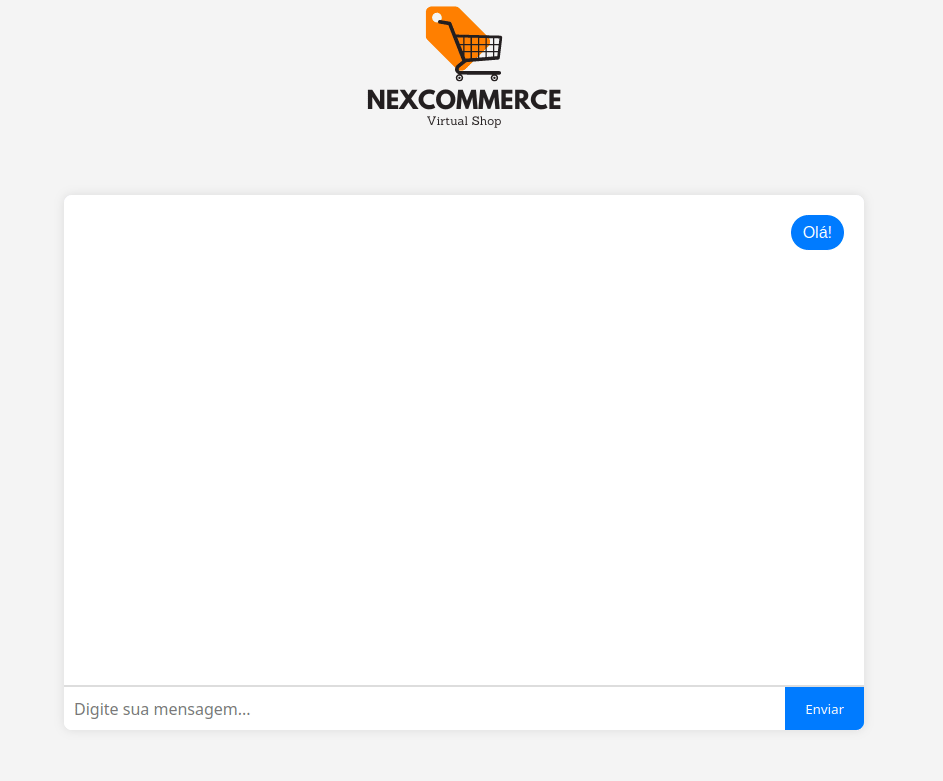

# spring-openai-chatbot

This project tests creation of **chatbot** based on **Spring Boot**, utilizing **OpenAI's API** to process natural language and generate automated responses.

A Customer Assistant is implemented using Vector Store to provide context for the chatbot to respond.




## Installation

### Project Setup Steps

1. Clone this repository:
   ```bash
   git clone https://github.com/diegoqueres/spring-openai-chatbot.git
   cd spring-openai-chatbot
   ```

2. Build the Docker image:
   ```bash
   docker build -t spring-openai-chatbot .
   ```

### Running the Application

1. After building the Docker image, you can run the container using the following command:
   ```bash
   docker run -p 8080:8080 \
       -e OPENAI_API_KEY=your_openai_api_key \
       -e DB_URI=your_mongodb_uri \
       -e DB_DATABASE=your_mongodb_name \
       -e REDIS_URI=your_redis_uri \
       spring-openai-chatbot
   ```

2. Access the customer assistant chatbot via browser
   ```
   http://localhost:8080
   ```
   or API at port `8080` on your localhost: `http://localhost:8080/api/v1`

## Environment Variables

The application depends on several environment variables to run properly:

- `OPENAI_API_KEY`: OpenAI API key. Sign up at [OpenAI](https://openai.com/api/) to get your key.
- `DB_URI`: MongoDB connection URI. You can create a database at [MongoDB Atlas](https://www.mongodb.com/) and use the generated URI here.
- `DB_DATABASE`: MongoDB database name. You can define any name of your choice, such as `nexcommerce` or `customerassistant`.
- `REDIS_URI`: Redis connection URI. You can create a Redis instance on [Redis Cloud](https://redis.io/try-free/) and use the generated URI here.